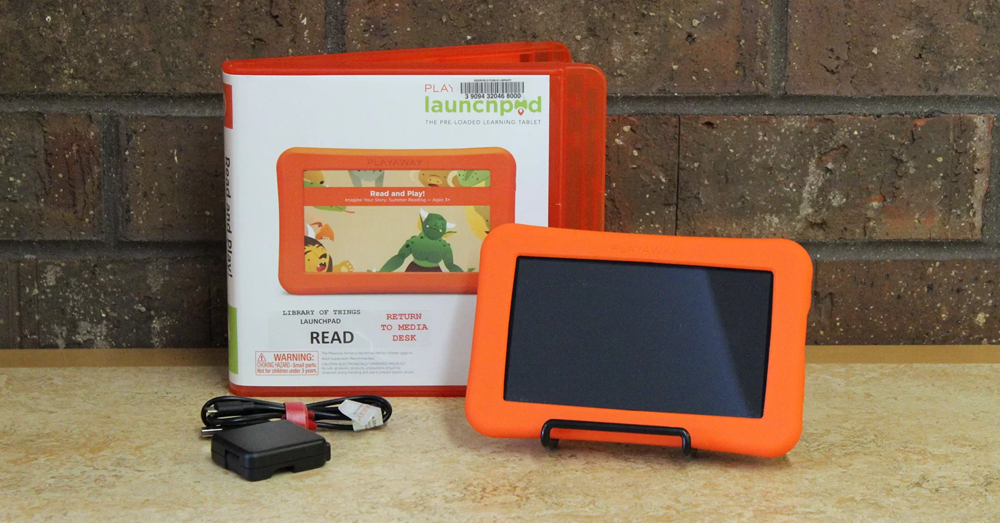

# TWRP Device Tree for Playaway Launchpad

Device tree for building TWRP for the Playaway Launchpad based on the Allwinner A33



## Device Information

| Component       | Value          |
| --------------- | -------------- |
| SoC             | Allwinner A33  |
| GPU             | Mali-400 MP2   |
| Architecture    | ARMv7          |
| Android version | 4.4.2          |
| Display         | 1024 × 600     |
| Touchscreen     | GSLX680        |
| Memory          | 1GB            |
| Storage         | 8GB (Raw NAND) |
| WiFi            | None           |
| Bluetooth       | None           |
| Camera          | None           |

The stock firmware identifies the underlying Allwinner board as `astar-y3`, but this tree is intended specifically for the Playaway Launchpad hardware.

# Known issues

- RTC does not retain real-world time in recovery, so TWRP starts with a date near the Unix epoch.
- The recovery ramdisk must remain below approximately 8 MiB due to the device's boot process. I removed extra twrp languages from the build.

## Flashing

The stock firmware is an Android `eng` build with root access available by default.

The recovery partition is:

```text
/dev/block/nandf
```

Flash TWRP with:

```bash
adb push recovery.img /sdcard/twrp.img
adb shell 'dd if=/sdcard/twrp.img of=/dev/block/nandf bs=1M && sync'
adb reboot recovery
```

## Partition Layout

| Node               | Partition  |
| ------------------ | ---------- |
| `/dev/block/nanda` | bootloader |
| `/dev/block/nandb` | env        |
| `/dev/block/nandc` | boot       |
| `/dev/block/nandd` | system     |
| `/dev/block/nande` | misc       |
| `/dev/block/nandf` | recovery   |
| `/dev/block/nandg` | cache      |
| `/dev/block/nandh` | private    |
| `/dev/block/nandi` | metadata   |
| `/dev/block/nandj` | data       |

```
#
# Copyright (C) 2026 The Android Open Source Project
# Copyright (C) 2026 SebaUbuntu's TWRP device tree generator
#
# SPDX-License-Identifier: Apache-2.0
#
```
